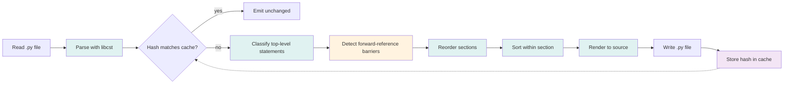
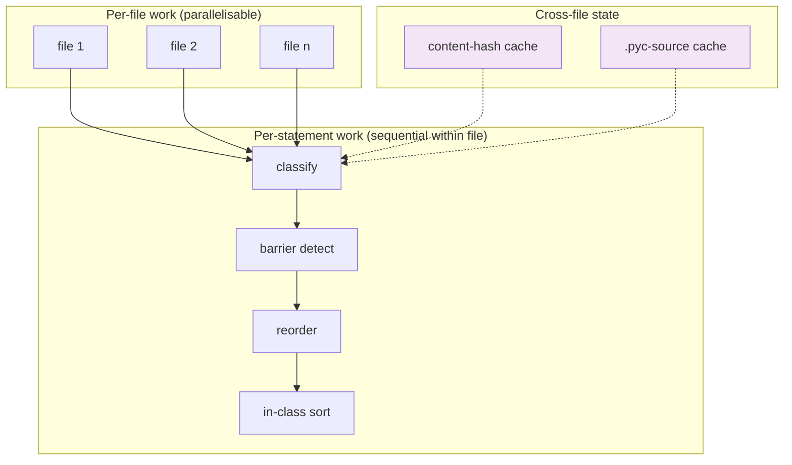

# Architecture

`pyreorder` reorganizes a Python module without changing what it does. The work is
done by a small pipeline of pure functions over a `libcst.Module` tree. Each
stage is independently testable; the only state that survives across files is
the on-disk content-hash cache.

## Pipeline

The stages are:

| # | Stage | Module | Responsibility |
|---|---|---|---|
| 1 | **Read** | `pipeline.py` | Load source as UTF-8 text |
| 2 | **Parse** | `libcst.parse_module` | Produce a CST preserving formatting (parens, quotes, comments) |
| 3 | **Cache check** | `cache.py` | Skip the rest if the content hash is unchanged |
| 4 | **Classify** | `classify.py` | Assign each top-level statement to a *section* (`imports`, `typing_imports`, `module_constants`, `runtime_setup`, `enums`, `dataclasses`, `classes`, `functions`, `dunder_exports`, `main_block`, …) |
| 5 | **Barrier detect** | `classify.py` | Mark statements with forward references as barriers so they stay in place |
| 6 | **Section reorder** | `pipeline.SectionSorter` | Emit sections in the order from `Config.sections` |
| 7 | **In-section sort** | `sorters.py` / `undersort.py` | Apply the per-section strategy (`keep` / `alpha` / `stepdown` / `abstraction`) |
| 8 | **Render** | `libcst.Module.code` | Serialize the CST back to source text |
| 9 | **Write** | `pipeline.py` | Atomically replace the file |
| 10 | **Cache store** | `cache.py` | Persist the new content hash |

## Safety model

`pyreorder` does not change semantics — only statement order. Three invariants make
that possible:

1. **Formatting-preserving parse.** `libcst` keeps parentheses, quote styles,
   and comments intact. Round-tripping a file through `pyreorder` without changes
   is byte-identical to the input.
2. **Forward-reference barriers.** A statement that references a name defined
   in a later configured section is treated as a barrier: it stays where it is.
   Without this, `logger = logging.getLogger(__name__)` could land below its
   first use. See [ADR 0002](adr/0002-forward-reference-barriers.md).
3. **Unrecognised sections are barriers too.** Statements whose section is
   absent from `Config.sections` (e.g. `app = typer.Typer()`) never move.
   `pyreorder` errs on the side of leaving unfamiliar code alone.

The combination means `pyreorder` is safe to run on a module it has never seen:
if it can't classify a statement, it doesn't touch the surrounding block.

## Where the work happens

Files are independent — the `parallel` execution backend (`pyreorder --jobs N`)
shells out one process per file. Within a file, the four stages share a single
`libcst.Module` object, so they run sequentially.

## Public API

The pipeline is exposed through one entry point: `sort_source` in
`pipeline.py`. The Typer CLI (`cli/app.py`) is a thin wrapper that handles
configuration loading, file discovery, and parallelism. There is no stable
scripting API beyond `sort_source`; downstream tools should shell out to the
`pyreorder` CLI to inherit future improvements.

## Why this shape

The pipeline is **left-to-right and stateless** so that every stage is testable
in isolation. The barrier logic lives in `classify.py` (not `pipeline.py`) so it
can be exercised with hand-built CST nodes. The cache is the only piece with
disk state, and it lives behind a small interface — see `cache.py` for the
content-hash and `.pyc` schemes.

See also: [Configuration](configuration.md), [Section layout](section-layout.md),
[Sorting modes](sorting-modes.md), and the architecture decision records under
[ADRs](adr/index.md).
